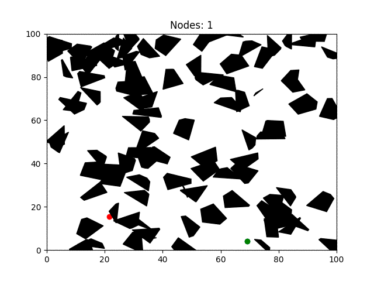
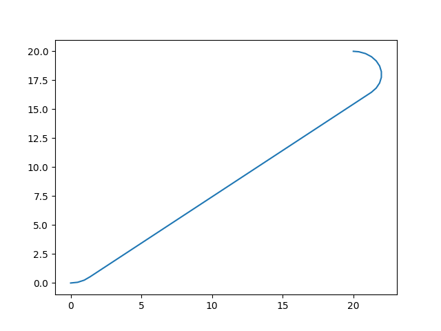
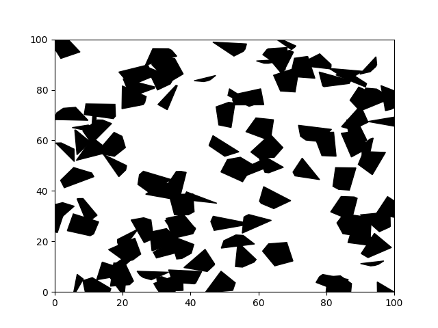
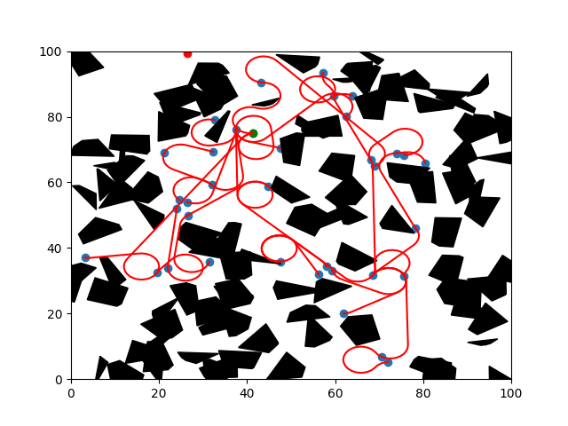

# RRT-Dubins
[](https://lgtm.com/projects/g/FelicienC/RRT-Dubins/context:python)
[](https://www.codefactor.io/repository/github/felicienc/rrt-dubins)
[](https://travis-ci.org/FelicienC/RRT-Dubins)
[](https://coveralls.io/github/FelicienC/RRT-Dubins?branch=master&service=github)
[](https://opensource.org/licenses/MIT)


Simple implementation of a **Rapidly Exploring Random Tree** using **Dubins path** as an expansion method, in a 2D environment filled with polygonal obstacles. Check the documentation [here](https://felicienc.github.io/RRT-Dubins/index.html).
<p align="center">
  
</p>

## Requirements

- [Scipy](https://www.scipy.org)
- [Numpy](https://numpy.org)
- [Matplotlib](https://matplotlib.org)
- [Shapely](https://pypi.org/project/Shapely)

## Dubins path

Dubins path refers to the shortest curve that connects two points in the two-dimensional Euclidean plane if only one direction of movement is permitted (the vehicle can only go forward). This type of path is necessarly in the form of one of 6 types, combination of right turns (**R**), left turns (**L**) and straight segments (**S**): **RLR, LRL, LSR, RSL, LSL, RSR**.

### How does it work ?

As we want to have the shortest path among the 6 potential candidates, we compute the lenght of the path we would obtain if we followed each of the trajectories. To do so, we need to separate three cases:
  1. **LSL** and **RSR** : Two turns in the same direction separated by a straight segment
  2. **LSR** and **RSL** : Two turns in opposite directions separated by a straight segment
  3. **RLR** and **LRL** : Three turns

### Usage 

The Dubins path are implemented in the Dubins class. As already mentionned, we simplify the problem here by considering the same radius for all the turns.

```python

from dubins import Dubins

# We initialize the planner with the turn radius and the desired distance between consecutive points
local_planner = Dubins(radius=2, point_separation=.5)

# We generate two points, x, y, psi
start = (0, 0, 0) # heading east
end = (20, 20, 3.141) # heading west

# We compute the path between them
path = local_planner.dubins_path(start, end)
```
The variable *path* now contains the sequence of points (x, y) linking the start and finish points given as input with only turns of a defined radius and straight line in the form of a (2xn) numpy array.

```python
import matplotlib.pyplot as plt

plt.plot(path[:, 0], path[:, 1])
```
<p align="center">
  
</p>

## RRT

### How does it work ?

The idea behind a RRT is to incrementally construct a search tree that gradually improves its resolution so that in the limit,  it densely covers the space.  The tree starts rooted at a starting configuration, and grows by using random samples from the search space. As each sample is drawn, a connection is attempted between it and the nearest state in the tree. If the connection is feasible (passes entirely through free space and obeys all constraints), this results in the addition of the new state to the tree.

With uniform sampling of the search space, the probability of expanding an existing state is proportional to the size of its Voronoi region, (i.e. the ensemble of points closer to this state then to any other state of the graph). As the largest Voronoi regions belong to the states on the frontier of the search, this means that the tree preferentially expands towards large unsearched areas, and therefore rapidly expands.

### Usage

The rapidly exploring random tree is implemented in the RRT class.
In order to use it, the environment needs to be defined first. To start, two types of environments can be used.

#### Static Environment

In the static environment, the obstacles are polygonal and are stored in a binary search tree in order to increase the speed of the colision check.
The following code initializes an Environment:
```python
from environment import StaticEnvironment
from rrt import RRT

# We create an environment of 100x100 meters, with 100 obstacles
env = StaticEnvironment((100, 100), 100)
env.plot()
```
<p align="center">
  
</p>

```python
# We initialize the tree with the environment
rrt = RRT(env)

# We select two random points in the free space as a start and final node
start = env.random_free_space()
end = env.random_free_space()

# We initialize an empty tree
rrt.set_start(start)

# We run 100 iterations of growth
rrt.run(end, nb_iteration=100)

env.plot()
rrt.plot(nodes=True)
```
<p align="center">
  
</p>

#### Dynamic Environment
In the dynamic environement, two options are available: the obstacles can either move or stay static. In both cases, the tree is pruned of the unreachable nodes once they are passed.

```python
from dynamic_environment import DynamicEnvironment
from rrt import RRT

env = DynamicEnvironment((100, 100), 5, moving=False)

```

```python
# We initialize the tree with the environment
rrt = RRT(env)

start = (50, 1, 1.57) # At the bottom of the environment
end = (50, 99, 1.57) # At the top of the environment

# Initialisation of the tree, to have a first edge
rrt.set_start(start)
rrt.run(end, 200, metric='local')

```

However, to display several frames at different timestamps, a small loop is required, as follows:
```python
# Initialisation of the position of the vehicle
position = start[:2]
current_edge = rrt.select_best_edge()

# We let it run for a few steps
time = 0
for i in range(500):
    time += 1
    # We check if we are on an edge or if we have to choose a new edge
    if not current_edge.path:
        time = rrt.nodes[current_edge.node_to].time
        current_edge = rrt.select_best_edge()
    # Update the position of the vehicle
    position = current_edge.path.popleft()
    # Update the environment
    #   The frontiers of the sampling and the obstacles
    env.update(position)
    #   The position of the goal
    end = (50, position[1]+90, 1.57)
    # Continue the growth of the tree, we try to add only 2 nodes
    rrt.run(end, 2, metric='local')
    # Ploting and generating an image (the most time consuming step)
    env.plot(time, display=False)
    rrt.plot(file_name='moving'+str(i)+'.png', close=True)
```
This code executes relatively slowly due to the time needed to plot every single frame with matplotlib.
Here is the result obtained by concatenating all the produced images into one gif file.

<p align="center">
  
</p>

## References

[Steven M. LaValle](http://msl.cs.illinois.edu/~lavalle/papers/Lav98c.pdf) "Rapidly-Exploring Random Trees: A New Tool for Path Planning" 1998, tech. rpt C.S.Dept, Iowa State University

[Wikipedia](https://en.wikipedia.org/wiki/Rapidly-exploring_random_tree)
