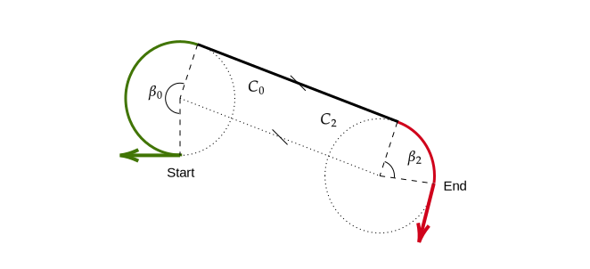
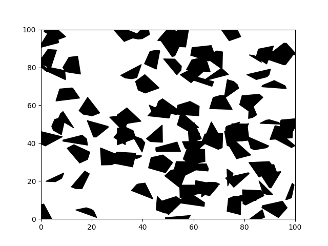

# RRT-Dubins
[](https://lgtm.com/projects/g/FelicienC/RRT-Dubins/context:python)
[](https://www.codefactor.io/repository/github/felicienc/rrt-dubins)
[](https://travis-ci.org/FelicienC/RRT-Dubins)
[](https://coveralls.io/github/FelicienC/RRT-Dubins?branch=master)
[](https://opensource.org/licenses/MIT)


Simple implementation of a **Rapidly Exploring Random Tree** using **Dubins path** as an expansion method, in a 2D environment filled with polygonal obstacles. Check the documentation [here](https://felicienc.github.io/RRT-Dubins/index.html).
<p align="center">
  
</p>

## Requirements

- [Scipy](https://www.scipy.org)
- [Numpy](https://numpy.org)
- [Matplotlib](https://matplotlib.org)
- [Shapely](https://pypi.org/project/Shapely)

## Dubins path

Dubins path refers to the shortest curve that connects two points in the two-dimensional Euclidean plane if only one direction of movement is permitted (the vehicle can only go forward). This type of path is necessarly in the form of one of 6 types, combination of right turns (**R**), left turns (**L**) and straight segments (**S**): **RLR, LRL, LSR, RSL, LSL, RSR**.

### How does it work ?

As we want to have the shortest path among the 6 potential candidates, we compute the lenght of the path we would obtain if we followed each of the trajectories. To do so, we need to separate three cases:
  1. **LSL** and **RSR** : Two turns in the same direction separated by a straight segment
  2. **LSR** and **RSL** : Two turns in opposite directions separated by a straight segment
  3. **RLR** and **LRL** : Three turns
  
*In order to furthermore simplify the following steps, we consider here that all the turns in one trajectory are done using the same turn radius*
  
#### 1) Two turns in the same direction separated by a straight segment
<p align="center">
  
</p>
We start by finding the centers of the turns at the start and end of the trajectory, describing the circles C1 and C2. This is direct as we know the direction and radius of these turns.

The second step is to find the position of the two tangent points on these circles, where the straight segment starts and end.
Because we have the same radius on both C1 and C2, the tangent to both circles is parallel to the line passing by both centers. By simply translating the vector defined by these center in the orthogonal direction from one radius, we obtain the straight segment. We can then use this vector to compute the two angles beta1 and beta2.

#### 2) Two turns in opposite directions separated by a straight segment
<p align="center">
  
</p>
This case is a litle more complex than the previous one, but starts in a similar way, by finding the centers of the turns at the start and end of the trajectory, C1 and C2. We however then need to introduce the rectangle triangle ABX in order to compute the lenght of the straight segment. Calculating the angles beta0 and beta2 is then straightforward. 

#### 3) Three turns
<p align="center">
  
</p>
This situation is only possible when the centers of the two circles C1 and C2 are separated by less than 4 radii. If it is the case, the trajectory is completly described by 3 angles, beta0, beta1 and beta2. 

### Usage 

The Dubins path are implemented in the Dubins class. As already mentionned, we simplify the problem here by considering the same radius for all the turns.

```python

from dubins import Dubins

# We initialize the planner with the turn radius and the desired distance between consecutive points
local_planner = Dubins(radius=2, point_separation=.5)

# We generate two points, x, y, psi
start = (0, 0, 0) # heading east
end = (20, 20, 3.141) # heading west

# We compute the path between them
path = local_planner.dubins_path(start, end)
```
The variable *path* now contains the sequence of points (x, y) linking the start and finish points given as input with only turns of a defined radius and straight line in the form of a (2xn) numpy array.

```python
import matplotlib.pyplot as plt

plt.plot(path[:, 0], path[:, 1])
```
<p align="center">
  
</p>

## RRT

### How does it work ?

The idea behind a RRT is to incrementally construct a search tree that gradually improves its resolution so that in the limit,  it densely covers the space.  The tree starts rooted at a starting configuration, and grows by using random samples from the search space. As each sample is drawn, a connection is attempted between it and the nearest state in the tree. If the connection is feasible (passes entirely through free space and obeys all constraints), this results in the addition of the new state to the tree.

With uniform sampling of the search space, the probability of expanding an existing state is proportional to the size of its Voronoi region, (i.e. the ensemble of points closer to this state then to any other state of the graph). As the largest Voronoi regions belong to the states on the frontier of the search, this means that the tree preferentially expands towards large unsearched areas, and therefore rapidly expands.

### Usage

The rapidly exploring random tree is implemented in the RRT class.
In order to use it, the environment needs to be defined first. Here the obstacles are stored in a binary search tree in order to increase the speed of the colision checking. 

```python
from environment import Environment
from rrt import RRT

# We create an environment of 100x100 meters, with 100 obstacles
env = Environment((100, 100), 100)

env.plot()
```
<p align="center">
  
</p>

```python
# We initialize the tree with the environment
myRRT = RRT(env)

# We select two random points in the free space as a start and final node
start = env.random_free_space()
end = env.random_free_space()

# We initialize an empty tree
myRRT.set_start(start)

# We run 100 iterations of growth
myRRT.run(end, precision=(5, 5, 1), nb_iteration=100)
myRRT.plot_tree()
```

### Performance

In the current implementation, the default metric used to search for the closest node on the tree uses the local planner in order to measure the real distance needed to link the sample to all the nodes in the tree. To increase the computation speed, it is also possible to use instead the euclidian distance. 

## References

[Steven M. LaValle](http://msl.cs.illinois.edu/~lavalle/papers/Lav98c.pdf) "Rapidly-Exploring Random Trees: A New Tool for Path Planning" 1998, tech. rpt C.S.Dept, Iowa State University

[Wikipedia](https://en.wikipedia.org/wiki/Rapidly-exploring_random_tree)
